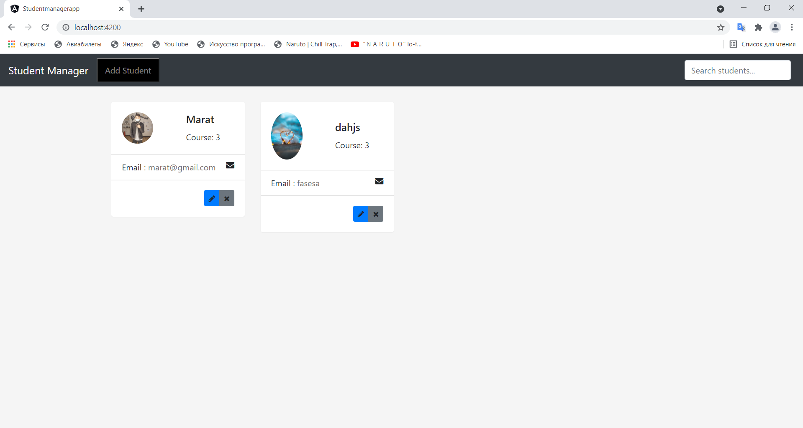
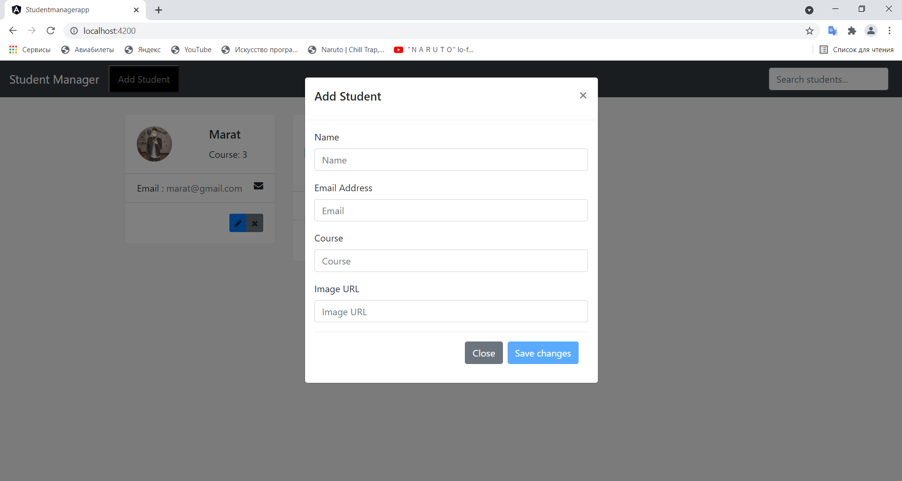

Studentmanager это бэк-енд проекта, сделанный с помощью Java Spring. 
А Studentmanagerapp это фронт-енд проекта, сделанный с помощью Angular. 
В проекте нету авторизации(не успел), но есть якобы система, управляющая студентами. Вы можете добавить или удалить студента.
Обращался в базу с помошью Spring data JPA, но не с помощью MyBatis. На его изучение тоже не хватило времени. Но главное обращаюсь в реляционную базу MySQL.

Что нужно сделать чтобы запустить проект? (Мой метод, как я запустил (IntellijIDEA и Visual Studio Code))
1) скачиваем Studentmanager, открываем с помощью IntellijIDEA.
2) Добираемся до файла application.properties (Путь: e-school\studentmanager\src\main\resources)
3) Настраиваем эти 3 файла под свой MySQL.
         
    spring.datasource.url=jdbc:mysql://localhost:3306/studentmanager
    
    spring.datasource.username=root
    
    spring.datasource.password=1234

4) Добираемся до файла StudentmanagerApplication.java (Путь: e-school\studentmanager\src\main\java\studentmanager).
5) Запускаем/Раним StudentmanagerAppliation.java и сворачиваем IntellijIDEA.
6) скачиваем Studentmanagerapp, открываем с помощью Visual Studio Code.
7) Открываем терминал в Visual Studio Code.
8) Пишем команду "ng serve". Ждем пока компиляция ответит успешно.
9) Открываем в браузере вкладку и вставляем "http://localhost:4200" ждем пока все прогрузится.

На этом проект должен успешно открыться.
Далее, видим кнопку(надпись) Add Student. 
При ее нажатии, откроется форма студента, нужно ввести все поля, чтобы сохранить/добавить нового студента.
В карточке студента видим кнопку красную кнопку x(удалить). При ее нажатии, выйдет подтверждение, действительно ли вы хотите удалить?(Только все на английском)
При нажатии на ДА, студент удалится.
В принципе на этом все(есть редактировать и поиск, но они не указаны в задании, вы заметите после запуска проекта).

